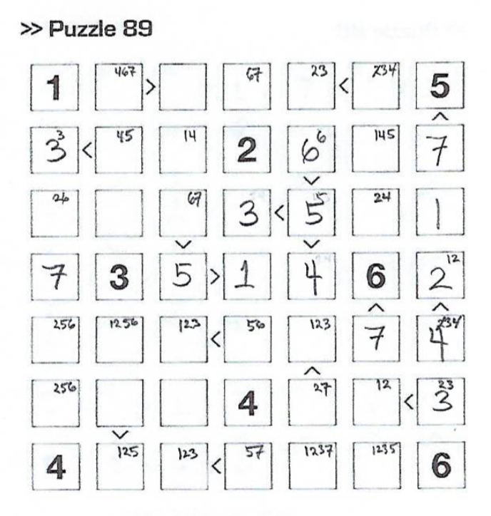

# Futoshiki #

This README file is under development.

The Futoshiki project seeks to implement a graphical user
interface (GUI) for creating and solving Futoshiki puzzles, Sudoku-like
puzzles described and featured in Gareth Moore's (2012) puzzle book as
as combining "the row and column restraints [sic] of Sudoku with arrows
that indicate the smallest number of certain pairs."

Some typical Futoshiki puzzles as presented in Moore's (2012) puzzle book
look like this:

That image above shows a scanned image of pg 24 with 4 different,
unsolved 7 x 7 puzzles. The goal is to fill the remaining squares so
that (for 7 x 7 puzzles) each number 1–7 appears exactly once in each
row and in each column, *plus* every pair of numbers separated by the
< or > symbols must obey the corresponding less than/greater than
relationship.

The first (handwritten) steps in solving Puzzle 89 are shown in the
figure below. One of the very first steps was placing the 7 in the
6th column: that cell must have an integer 1, 2, ..., 7 that is
greater than 6, and thus 7 was the only choice. Other cells show
some smaller, handwritten "mark-up" notation to indicate that the
possibilities have been narrowed down to some useful subset of the
possible values 1, 2, ..., 7.

## Getting Started ##

[When complete,] the project can be run directly from the latest
.jar file ...,
which can be downloaded and opened directly on your local system.
The project could also be run from inside IntelliJ IDEA, with the main
access point being the Main() class, but this will require of course
the appropriate installation of and access to the JavaFX library.

## Running the Program: Entering & Solving a Puzzle ##

**PLANNED**

**Stage 1**: User can enter a set of "given" cell values and <, >
comparators, "lock them in" (given values then appearing in bold,
for example), then solve the puzzle.

**Stage 2**: As in Stage 1, *and* program will verify that any eventual
solution entered is valid.

**Stage 3**: As in Stage 2, *and* program will initially verify that
the proposed puzzle is valid at the "lock-in" stage.

**Stage 4**: Program will be able to *generate* puzzles of varying
size and difficulty level. This will require work on both an algorithm
for generating valid puzzles (*i.e.* a puzzle with a unique solution)
and a system for rating the difficulty level.

## Extras ##

The project includes ....

## Built With ##

The program is written in Java, using JavaFX and IntelliJ IDEA.

## Authors and Contributors ##

Authors: 
Warren D. Craft (wdc) 
Tyler H. Fenske (thf) 

## Acknowledgments ##

Some acknowledgments here. 

# Some Development Notes #

<b>Sat 06/01/2019</b>
Establishing an initial local and remote repository, including this
README document.

# Design & Design Issues #

The general design is shown in the instance diagram included in the /doc
directory.

# Known Issues #

(1) ....

# Further Development #

Some immediate next steps in development would
include:

(1) ....

(2) ....

(3) ....

